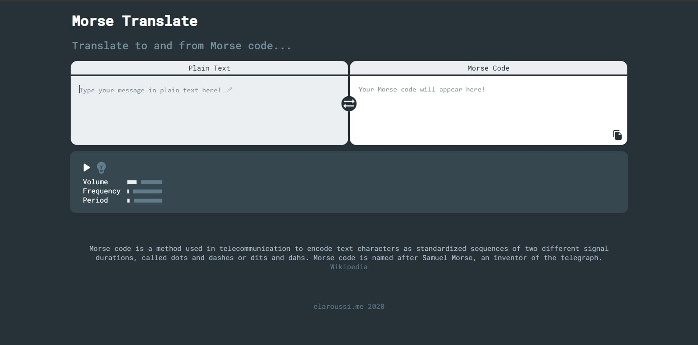

# Morse Translate 📡

## Convert plain text to Morse code and vice versa

Morse Translate is a little UI created with React that help translate to and from [Morse code](https://en.wikipedia.org/wiki/Morse_code), as well as playing the encoded message as a sequence of tones.



### [Demo](https://elaroussi.me/morse-translate)

## For developers

This project uses [React](https://reactjs.org), a Javascript library to create the different ui components, [the Web Audio API](https://developer.mozilla.org/en-US/docs/Web/API/Web_Audio_API) to generate tones, manipulate their volume and frequency, and [Material ui](https://material-ui.com) for icons and tooltips.

```bash
git clone https://github.com/Abdelar/morse-translate.git
cd morse-translate
npm i
# to run a local server
npm start
# to build the project for production
npm run build
```
